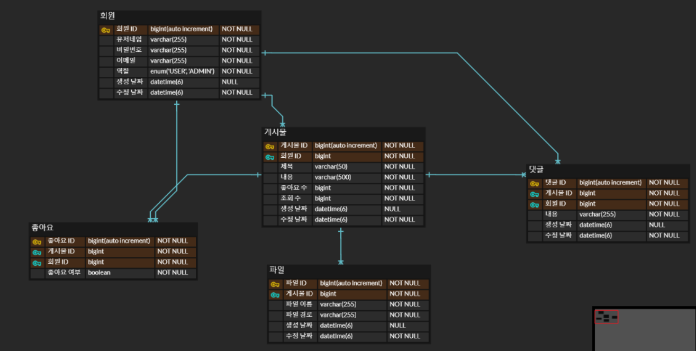
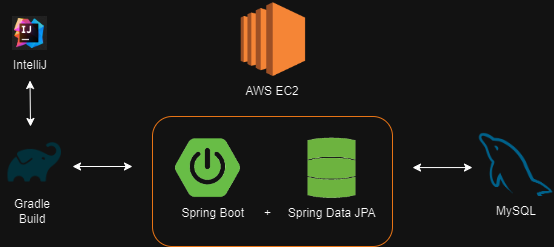

### 목차

> 1. ERD
> 2. 시스템 아키텍처
> 3. 기술 스택
> 4. 주요 기능
>    - 보안 : 회원가입, 로그인, 비밀번호 변경
>    - 사용자 : 글 작성, 수정, 이미지 첨부 | 좋아요, 조회수 기능

# 프로젝트 소개

> 세상에 많지만 찾기 힘든 맛집을 소개받고 공유하는 맛집 SNS 시스템입니다.  
>
> Spring Boot와 Spring Data JPA로 기본적인 MVC 구조를 구현하고  
> EC2 서버와 RDS 데이터베이스를 이용해 서버를 배포했습니다.

> ### 개발 기간 및 인원
>
> 2024-01-17 ~ 2024-02-13  
> 백엔드 1명

# ERD

[👉 ERD Cloud에서 직접 보기](https://www.erdcloud.com/d/tmevxXEQXnNumW58i)

# 시스템 아키텍처

# 기술 스택 

- Java 17
- Spring boot 3.2.1
  - Spring JPA
  - Spring Security
- JUnit5
- Github
- AWS EC2
- AWS RDS( MySQL )
- Thymeleaf

# 주요 기능

#### 요약

|                             보안                             |                          사용자                          |
| :----------------------------------------------------------: | :------------------------------------------------------: |
| - 회원가입, 로그인, 비밀번호 변경  - 게시물 목록 및 게시물 상세 페이지 접근 | - 글 작성, 수정, 이미지 첨부  - 좋아요, 조회수 기능 |

## [ 보안 기능 ]

### 회원가입, 로그인

- 사용자는 아이디, 비밀번호, 이메일을 이용해 회원가입할 수 있다.

### 게시물 목록 및 게시물 상세 페이지 접근

- 로그인한 사용자는 게시물 목록을 좋아요와 조회수가 높은 순으로 확인할 수 있고, 각 게시물의 상세 페이지를 조회할 수 있다.

## [ 사용자 기능 ]

### 글 작성, 수정, 이미지 첨부

- 글을 작성하고 수정할 수 있으며, 글에 이미지를 첨부할 수 있다.

### 좋아요, 조회수 기능

- 글을 조회한 횟수와 글을 좋아하는 사람들의 수를 확인할 수 있고, 좋아요를 누를 수 있다.

# 시연 영상

각 기능 시연 영상을 링크를 타고 확인해보세요.

[회원가입, 로그인 기능](https://youtu.be/5LsMbG4yqh0)

[글 작성, 수정, 삭제, 기능](https://youtu.be/xn4hO0pD64I)

[자신이 적은 글, 댓글, 조회, 계정 삭제 기능](https://youtu.be/frx8Wm11BDY)

# 웹 페이지 링크

[여기에서 접근해주세요!](http://ec2-13-125-217-29.ap-northeast-2.compute.amazonaws.com:8080/)